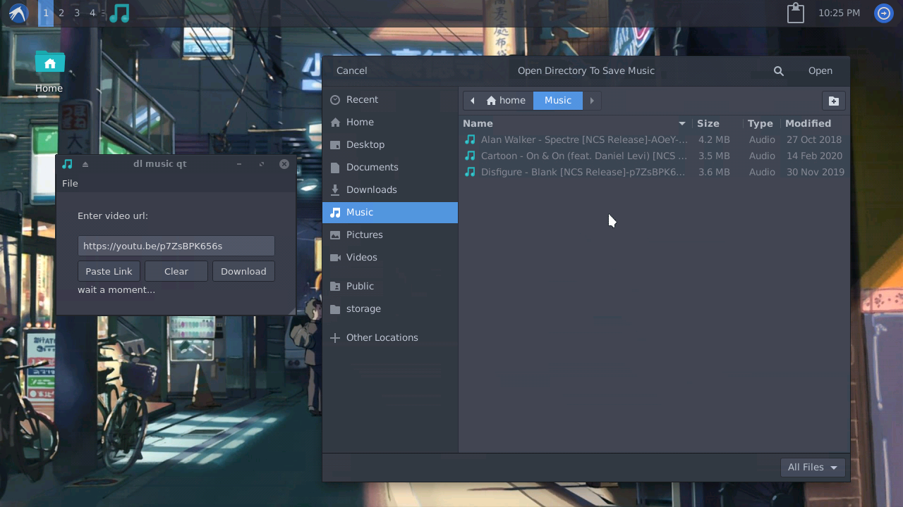

# dl-music-qt
Simple music downloader for youtube made in Qt



dl-music-qt is a simple application to download music from YouTube
Using the Qt library and youtube-dl, created for termux x11.

## Requirements

- qt5-qttools
- qt5-qtbase >= 5.10
- ffmpeg
- youtube-dl
- libnotify

## Installation

```bash
git clone https://github.com/Yisus7u7/dl-music-qt
cd dl-music-qt
./install.sh
```

install.sh you will install the application on termux x11. 

Improvements will be added in the future, if you want to contribute I thank you very much. 
